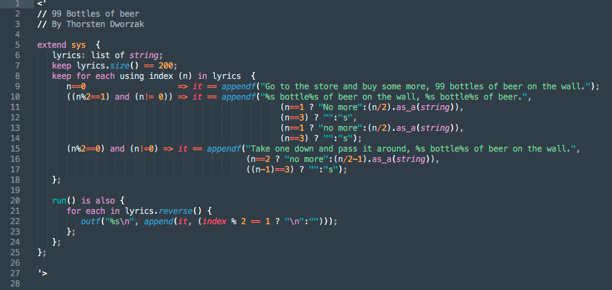

# Specman
Specman/e-language syntax for Sublime Text 3

## Manual Install
Place the syntax files somewhere in the Packages directory of Sublime. Check View->Syntax, an entry "Specman" should be there.
If not, check View-> Show Console for errors.

## Install via Package Control
Go to Preferences -> Package Control, "Install Package" and search for "Specman"

